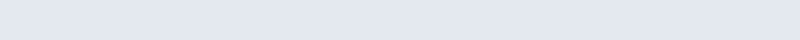
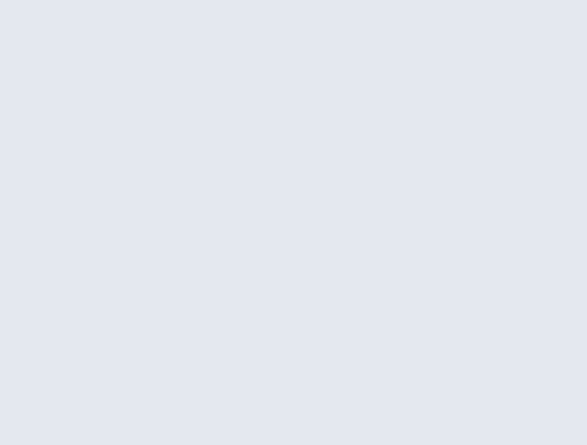

# Coding Balance

<p align="center">
  <strong>火山方舟 Coding Plan 剩余额度 · macOS 菜单栏实时监控</strong>
</p>

<p align="center">
  <a href="https://github.com/boommanpro/coding-balance/actions/workflows/build.yml"></a>
  <a href="https://boommanpro.github.io/coding-balance/"></a>
  <a href="LICENSE"></a>
  
  
</p>

<p align="center">
  <a href="https://boommanpro.github.io/coding-balance/">🌐 项目官网（下载 / 使用 / 更新历史）</a>
  ·
  <a href="https://github.com/boommanpro/coding-balance/releases">⬇ 下载最新版</a>
  ·
  <a href="CHANGELOG.md">📝 更新历史</a>
</p>

菜单栏圆形指示环实时显示**近 5 小时剩余额度**，点击查看周/月明细与重置时间，支持多账户切换。数据来自火山引擎官方管控面 API，与控制台 1:1。



## 功能

- **菜单栏圆形指示**：近 5 小时剩余进度环 + 百分比（绿 ≥50%、橙 20–50%、红 <20%）
- **左键详情弹窗**：5h 大圆环主视觉 + 周/月统计 + 三个额度窗口明细（已用/剩余进度条、下次重置时间）
- **右键快捷菜单**：刷新 / 管理账户 / 退出
- **多账户**：切换「当前使用账户」即刷新并持久化，账户总览一键切换
- **自动刷新**：每 60 秒同步；支持 Coding Plan（百分比额度）与 Agent Plan（AFP 绝对值）
- **隐私安全**：AK/SK 仅存本机，直接请求官方 API，不上传第三方


## 下载与安装

1. 前往 [GitHub Releases](https://github.com/boommanpro/coding-balance/releases) 下载 `CodingBalance-macOS-vX.Y.Z.zip`
2. 解压后将 `CodingBalance.app` 拖入「应用程序」
3. 首次打开在「系统设置 → 隐私与安全性」允许，或右键应用 → 打开
4. 点击菜单栏齿轮 ⚙ → 添加账户 → 填入 AK/SK → 测试连接 → 保存

> 从源码构建：`cd macos && ./make_app.sh`（需 Swift 工具链）。

## 使用说明

- **AK/SK 获取**：[火山引擎 · API 访问密钥管理](https://console.volcengine.com/iam/keymanage)（建议 IAM 子账号并授予 `ark:GetCodingPlanUsage` 权限）
- **交互**：左键=详情，右键=菜单，悬停=账户名与 5h 剩余，弹窗内切换多账户
- **数据源**：`GetCodingPlanUsage`（Coding Plan，5h/周/月 已用百分比）、`GetAFPUsage`（Agent Plan，AFP 绝对值）、`GetPersonalPlan`（套餐信息）



## Python CLI（可选）

环境要求：Python 3.8+（仅标准库）。

```bash
export ARK_ACCESS_KEY=<你的AK>  ARK_SECRET_KEY=<你的SK>
python3 coding_balance.py auth-check      # 验证凭据
python3 coding_balance.py quota           # 查看剩余额度
python3 coding_balance.py quota --watch 10  # 每 10 秒刷新
python3 coding_balance.py models --coding-plan
python3 coding_balance.py pricing --coding-plan
python3 coding_balance.py selftest        # 校验签名实现
```

## 实现原理

- **签名**：按官方《签名方法》实现火山引擎 HMAC-SHA256（AK/SK → 逐级派生 kSigning）
- **API**：`GetCodingPlanUsage`（公网 OpenAPI）、`GetAFPUsage`、`GetPersonalPlan`、`ListArkCodingPlanModel`、`ListFoundationModels`、`ListModelActivations`
- **桌面端**：SwiftUI + AppKit `NSStatusItem`，无第三方依赖
- **平台扩展**：`Provider` 协议抽象，`ProviderKind` / `makeProvider` 中注册新平台即可

## 版本更新历史

见 [CHANGELOG.md](CHANGELOG.md) 与 [GitHub Releases](https://github.com/boommanpro/coding-balance/releases)。

## 相关链接

- 项目官网：https://boommanpro.github.io/coding-balance/
- 官方 Ark CLI：https://ark.volcengine.com/region:cn-beijing/docs/ark/ark-cli
- 签名方法：https://www.volcengine.com/docs/6369/67269
- Base URL 及鉴权：https://docs.volcengine.com/docs/82379/1298459
- AFP 抵扣规则：https://docs.volcengine.com/docs/82379/2516283

## License

[MIT](LICENSE)
